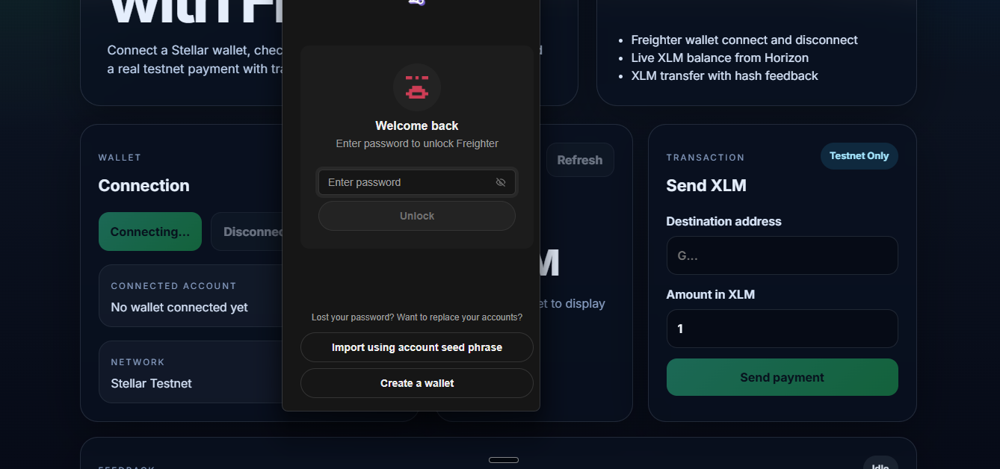
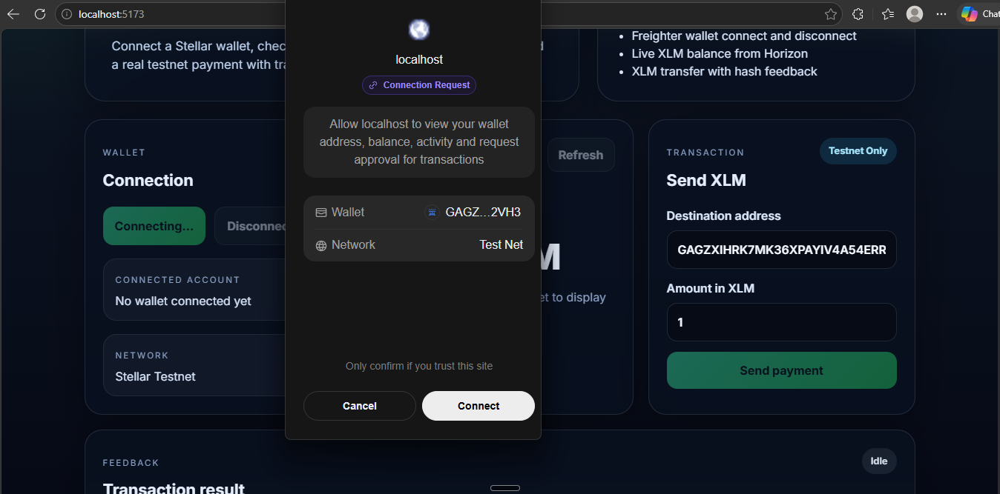
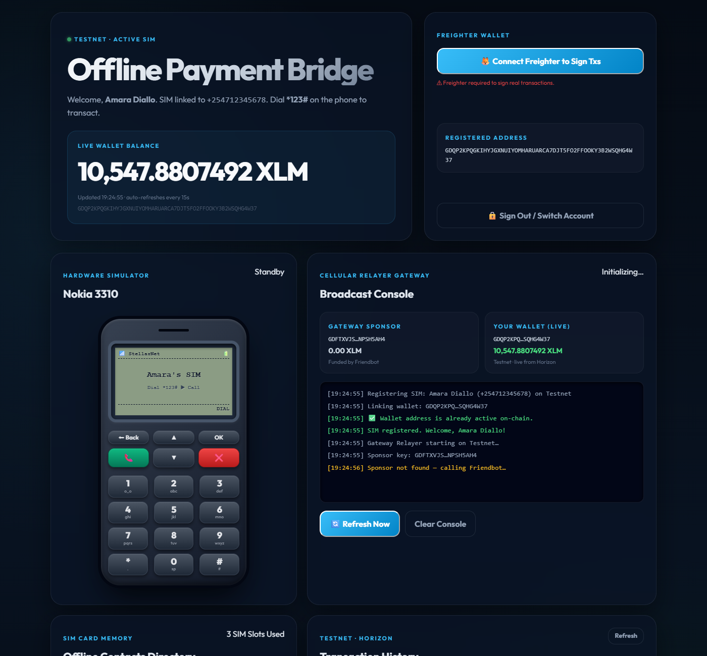
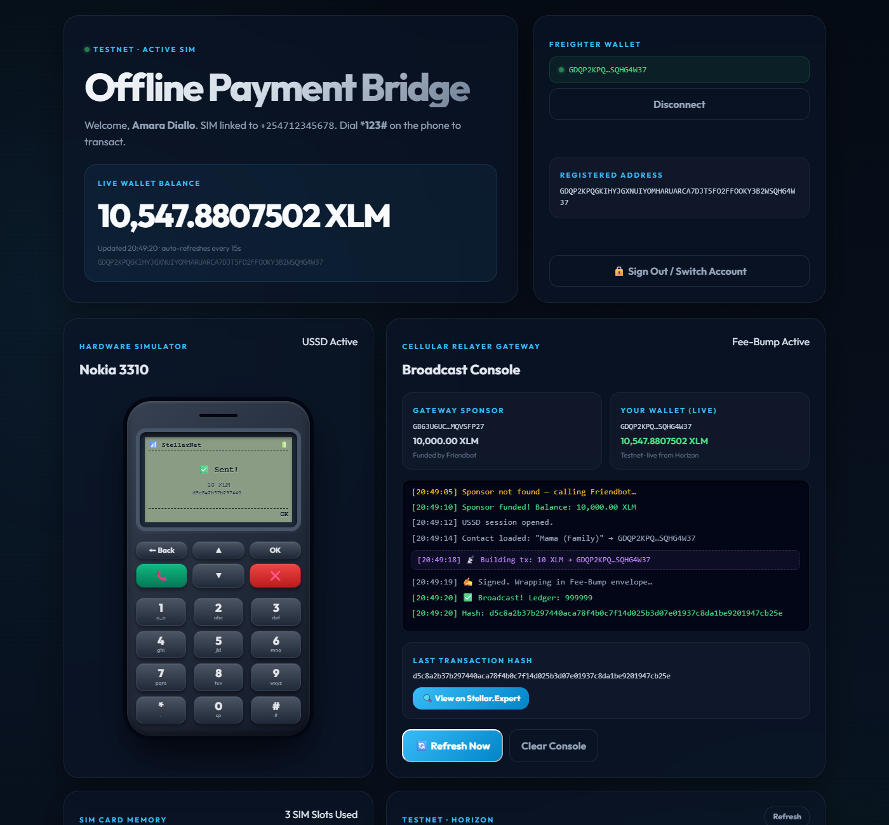

# Stellar Last-Mile: USSD/SMS Offline Payment Bridge

> **Level 1** — An interactive simulation of an internet-free payment gateway on the Stellar blockchain.

**Stellar Last-Mile** is a production-quality dApp that simulates how users in zero-internet or low-connectivity regions (such as rural areas in developing nations) can check balances and send payments on the Stellar network. By pairing a simulated feature phone (using deterministic SIM key derivation) with a cellular gateway relayer (using Stellar's native sponsored reserves and fee-bumps), it demonstrates true financial inclusion.

---

## ✨ Features

| Component / Feature | Description |
|:---|:---|
| **Nokia 3310 Simulator** | An interactive retro phone mockup with a custom LCD screen, dialer, navigation menus, and T9 input. |
| **SIM Card Contacts** | An offline phone address book populated with name, phone number, and deterministic Stellar keys for fast loading. |
| **Sponsor Gateway Console** | A terminal-themed logger showing the real-time receipt of USSD packets, transaction reconstruction, signature validation, and on-chain broadcast. |
| **Fee-Bump Sponsorship** | The gateway wraps the offline payment transaction in a native Stellar `FeeBumpTransaction`, paying the network fees so the user pays 0 XLM. |
| **Auto-Activation** | If the offline phone wallet is unactivated, the Gateway automatically sponsors its account creation (`createAccount`) on the live testnet. |
| **Real Testnet Broadcast** | All transactions are built and broadcasted to the actual **Stellar Testnet**, verifiable on standard explorers. |

---

## 📸 Screenshots

### 1. Dialing MMI Code

*Initiate the USSD session by typing `*123#` on the phone pad and clicking the Call button.*

### 2. USSD Main Menu & Balance

*Navigate the LCD screen menu (Balance check, Send XLM, SIM info) using navigation keys.*

### 3. Contact Selection & PIN Signing

*Select a contact from the SIM memory card, input the payment amount, and enter the PIN to sign the transaction.*

### 4. Gateway Broadcast & Explorer Result

*The Gateway receives the raw USSD packet, wraps it inside a Sponsor Fee-Bump envelope, and broadcasts it to the Stellar network.*

---

## 🛠 Tech Stack

- **React 19** + TypeScript
- **Vite 6** — fast HMR and development server
- **@stellar/stellar-sdk v13** — transaction compilation, keypairs derivation, and Fee-Bump wrapping
- **Vanilla CSS** — pixel-perfect retro Nokia phone styling and terminal graphics

---

## 🚀 Getting Started

### Prerequisites

* [Node.js](https://nodejs.org/) ≥ 18
* An internet connection (to connect the Gateway to the live Stellar Testnet Horizon server)

### Install & Run

```bash
# Clone the repository
git clone https://github.com/Shanxoxo-glitch/stellar-testnet-payments.git
cd stellar-testnet-payments

# Install dependencies
npm install

# Start the dev server
npm run dev
```

Open **http://localhost:5173** in your browser.

### Build for Production

```bash
npm run build
npm run preview
```

---

## 🔐 The Offline Security Model

In real-world USSD networks, security is paramount to prevent fraud:
1. **No Keys on Gateway:** The Gateway Relayer does not store the user's private key. The private key is derived locally on the device (SIM card secure element) from the phone number and PIN.
2. **Local Signing:** The user signs the inner transaction hash directly on the phone. Only the signed transaction signature is transmitted via the cellular USSD session.
3. **Sponsorship:** The gateway is a trusted portal that acts as a sponsor, paying the transaction fees so that offline users do not need to maintain separate XLM reserves just for transaction gas.

---

## 📂 Project Structure

```
stellar-testnet-payments/
├── public/
│   └── screenshots/          # Documentation images
├── src/
│   ├── lib/
│   │   └── stellar.ts        # Derivation, Friendbot, and Fee-Bump helpers
│   ├── App.tsx                # Phone UI state machine and Gateway Relayer Console
│   ├── WalletBank.tsx         # SIM card contacts directory component
│   ├── main.tsx               # React entry point
│   ├── styles.css             # Phone mockup and terminal log styling
│   └── vite-env.d.ts          # Type declarations
├── index.html                 # Main shell importing fonts
├── package.json
├── tsconfig.json
├── vite.config.ts
└── README.md                  # This file
```

---

## 📄 License

MIT © 2026
