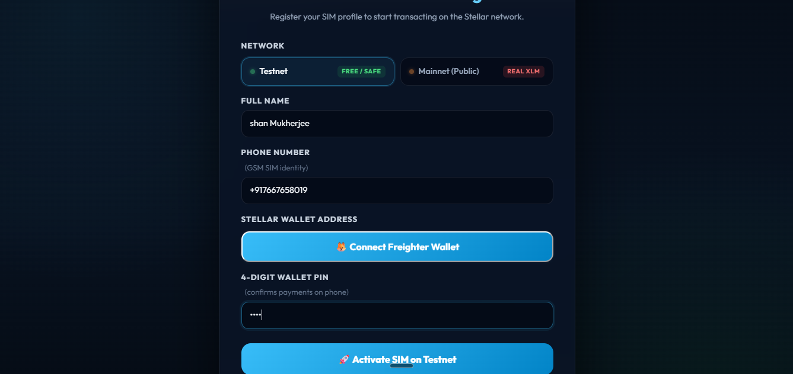
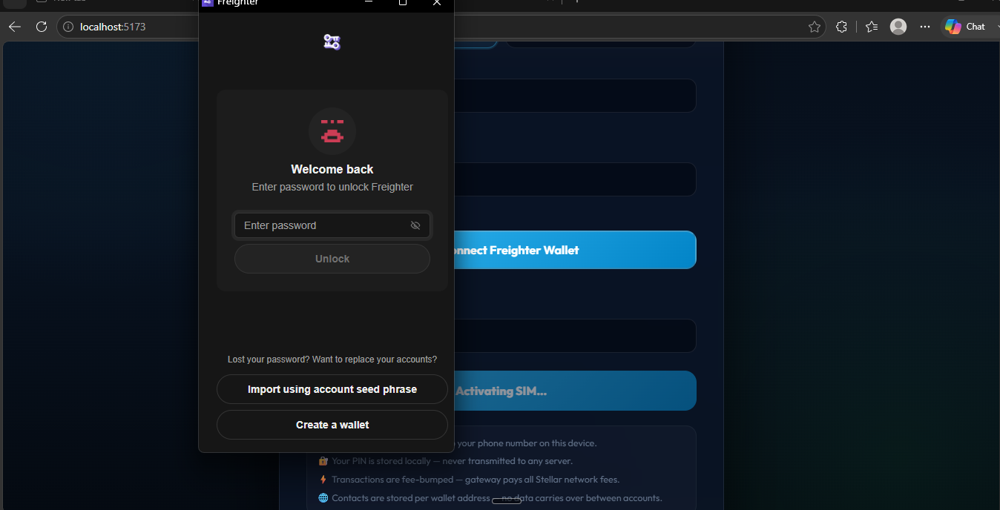
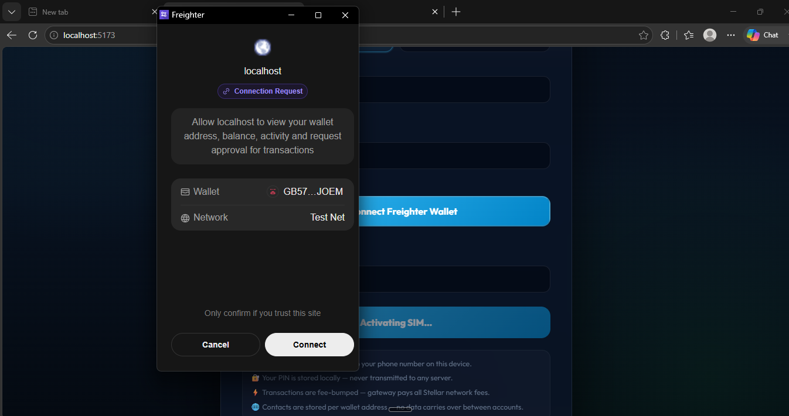
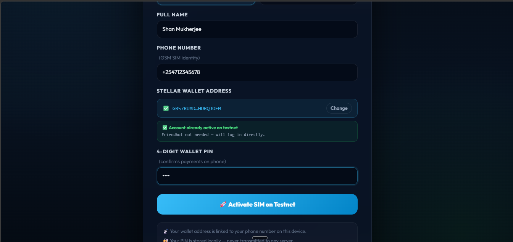
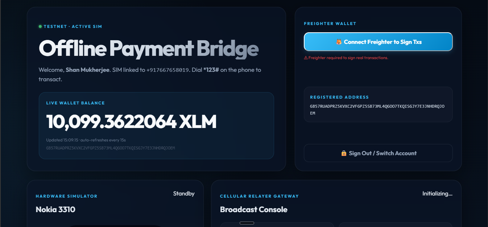
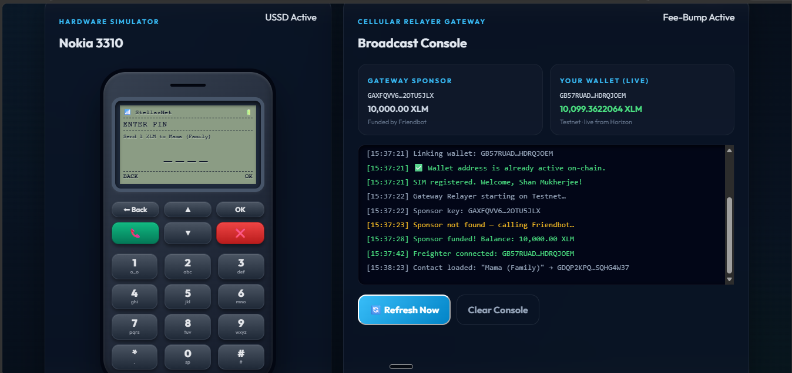
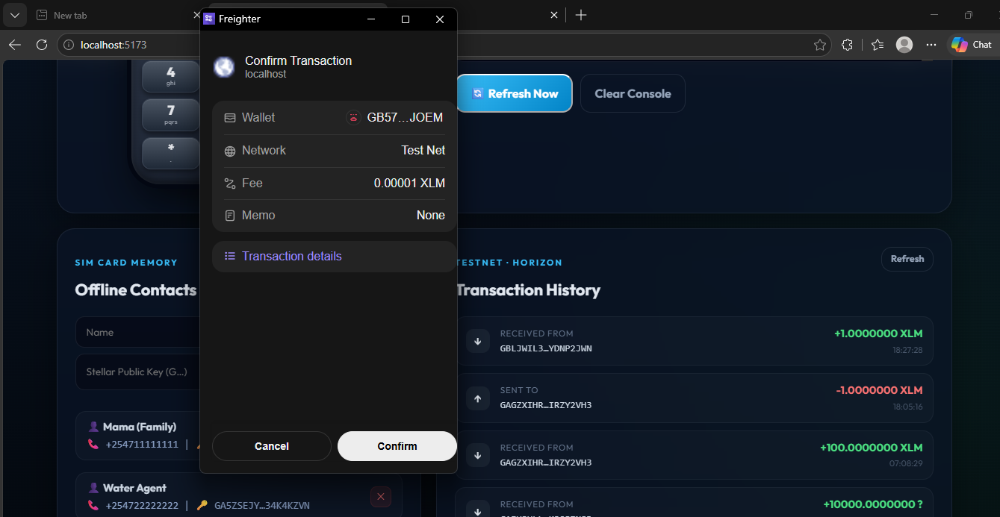
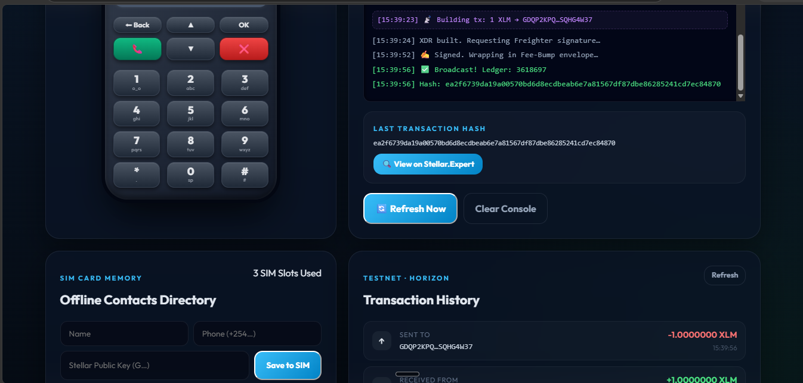
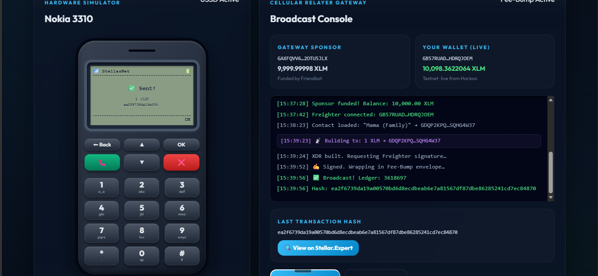

# Stellar Last-Mile: USSD/SMS Offline Payment Bridge

> **Level 1 Submission** — A working prototype of an internet-free payment gateway built on the Stellar blockchain, simulating how unbanked users in developing economies can transact using basic feature phones with no mobile data.

[](https://stellar.org)
[](LICENSE)

---

## 🌍 The Problem

Over 1.4 billion adults globally are unbanked. Stellar is designed to serve them — but every existing Stellar wallet (Freighter, Lobstr, Beans) **requires a smartphone and an active internet connection**.

In rural Kenya, Nigeria, or Bangladesh, mobile internet can cost $0.10–0.50/MB and is often unavailable. These populations already use **USSD** (the protocol behind M-Pesa, accessed by dialing `*123#`) — it works on any basic feature phone over the GSM signaling channel, with **zero mobile data required**.

**The gap:** Stellar has no bridge to USSD. This project builds that bridge.

---

## 💡 The Solution

A **USSD/SMS Gateway** that lets users send and receive Stellar XLM by dialing `*123#` on a Nokia-era feature phone — no internet, no smartphone, no crypto knowledge required.

```
User dials *123# on any GSM phone
        │
        ▼ (GSM signaling — no data)
Cellular USSD Gateway (this project's relay server)
        │
        ▼ (builds & fee-bumps Stellar transaction)
Stellar Horizon (testnet or mainnet)
        │
        ▼
Real XLM transferred on-chain ✅
```

---

## 💸 The Gateway Business Model (How It Pays for Itself)

This is the core economic innovation — identical to how **M-Pesa** works, applied to Stellar:

### The Flywheel

```
Operator buys 500 XLM (~$150 USD)
        │
        ▼
Operator's Gateway Wallet sponsors fee-bumps
        │ Pays 0.00001 XLM per transaction (Stellar network fee)
        ▼
User sends 100 XLM via USSD
        │ Gateway earns 0.3% service fee = 0.3 XLM (~$0.09)
        ▼
0.3 XLM returned to Gateway Wallet
        │
        ▼
Net: Gateway spent 0.00001 XLM, earned 0.3 XLM
     Profit per tx: 0.29999 XLM (~30,000x ROI on fee cost)
        │
        ♻ Self-sustaining — runs forever
```

### Why Users Accept the Fee

| Option | Cost to User |
|:---|:---|
| Western Union (rural) | 5–10% |
| Bank wire | 3–7% + fixed fees |
| M-Pesa | 1–3% |
| **This Gateway** | **0.3%** |

At 0.3%, this is the **cheapest remittance option available** to unbanked populations.

### Who is the Sponsor?

The **Gateway Operator** is the sponsor — the person or company running this relay service. They:
1. Buy real XLM on an exchange (Binance, Coinbase)
2. Fund a server-side gateway wallet (private key stored securely in environment variables — never in the browser)
3. Use Stellar's `FeeBumpTransaction` to pay network fees on behalf of users
4. Recover costs via the transparent 0.3% service charge on each transfer

In the prototype, the gateway sponsor is simulated client-side using a Friendbot-funded testnet keypair stored in `localStorage`. In production, this moves to a secure server environment.

---

## ✨ Features

| Feature | Description |
|:---|:---|
| **Real User Registration** | Sign-in with your name, phone number, and actual Stellar wallet address — your phone number is permanently linked to your on-chain address |
| **Testnet / Mainnet Selector** | Switch between Stellar Testnet (free, safe) and Mainnet (real XLM) at registration |
| **Live Account Pre-check** | As you type your wallet address, the app queries Horizon in real-time to check if it's already funded — skipping Friendbot if active |
| **Real-Time Balance** | Your XLM balance is fetched live from Horizon and auto-refreshes every 15 seconds |
| **Nokia 3310 Simulator** | An interactive feature phone mockup with LCD screen, keypad, USSD state machine, and T9 navigation |
| **Freighter Wallet Signing** | Connect Freighter to cryptographically sign transactions — the real private key never leaves your browser extension |
| **Sponsored Fee-Bump** | All transactions are wrapped in a Stellar `FeeBumpTransaction` — the gateway sponsor pays the 0.00001 XLM network fee so users pay nothing |
| **Per-Account Contact Isolation** | SIM contacts are stored separately per wallet address — switching accounts starts with a fresh SIM |
| **Live Transaction History** | Recent payments fetched from Horizon displayed with sent/received indicators and timestamps |
| **Stellar.Expert Explorer** | Every confirmed transaction links directly to the public blockchain explorer |

---

## 📸 Screenshots

### 1. Registration Form — Connect Freighter Wallet

*Fill in your name, phone number, and PIN. Click **🦊 Connect Freighter Wallet** to link your Stellar address — no manual copy-pasting required.*

### 2. Freighter Unlock

*The Freighter browser extension opens and prompts you to unlock it with your password.*

### 3. Freighter Connection Request

*Freighter shows the wallet address and network (Testnet), asking permission to connect to the site.*

### 4. Wallet Connected — Account Validated

*Once approved, the address auto-fills in the form and the app immediately checks if the account is active on testnet. Friendbot is called automatically if needed.*

### 5. Dashboard — Live Balance Displayed

*The main dashboard shows the live XLM balance fetched from Horizon (10,099 XLM), the registered wallet address, and the Freighter connect button to sign transactions.*

### 6. USSD Simulator — Entering Send Amount

*Dial `*123#` on the Nokia 3310 simulator, select Send XLM, choose a contact, and enter the amount. The gateway console shows live relay logs.*

### 7. USSD Simulator — Enter PIN to Confirm

*The phone prompts for a 4-digit PIN to confirm the payment before broadcasting the transaction.*

### 8. Freighter — Confirm Transaction Signature

*Freighter pops up showing the transaction details (wallet, network, fee). The user clicks Confirm to cryptographically sign the XDR.*

### 9. Broadcast Console — Transaction Hash

*The Gateway console shows the full transaction flow: XDR built → Freighter signed → Fee-Bump wrapped → Broadcast to Ledger 3618697. The real transaction hash is displayed with a View on Stellar.Expert link.*

### 10. Nokia Screen — ✅ Sent! Success State

*The Nokia screen confirms **✅ Sent!** with the transaction hash. The Broadcast Console shows the updated wallet balance (10,098 XLM) and the transaction appears in the Transaction History.*

---


## 🔐 The USSD Security Model

```
Phone (User)                Gateway Server            Stellar Network
    │                             │                         │
    │── Dials *123# ─────────────▶│                         │
    │◀─ USSD Menu ────────────────│                         │
    │── Selects "Send XLM" ──────▶│                         │
    │◀─ Enter amount + PIN ───────│                         │
    │── Signs with PIN ──────────▶│                         │
    │                             │── Builds inner TX ─────▶│
    │                             │── Fee-Bump signs ───────▶│
    │                             │◀─ TX confirmed ──────────│
    │◀─ SMS confirmation ─────────│                         │
```

**Key security properties:**
- **No private keys on the gateway** — the user's Freighter extension holds the private key; only signed XDRs travel over the network
- **PIN is local only** — the 4-digit PIN is stored in `localStorage` and never transmitted to any server
- **Cryptographic finality** — once on-chain, transactions cannot be reversed or altered

---

## 🛠 Tech Stack

- **React 19** + TypeScript
- **Vite 6** — fast HMR development server
- **@stellar/stellar-sdk v13** — transaction building, Fee-Bump wrapping, Horizon API
- **@stellar/freighter-api** — browser wallet integration for real transaction signing
- **Vanilla CSS** — retro Nokia phone styling, terminal console, glassmorphism cards

---

## 🚀 Getting Started

### Prerequisites

- [Node.js](https://nodejs.org/) ≥ 18
- [Freighter Wallet](https://www.freighter.app/) browser extension (for signing real transactions)

### Install & Run

```bash
git clone https://github.com/Shanxoxo-glitch/stellar-testnet-payments.git
cd stellar-testnet-payments
npm install
npm run dev
```

Open **http://localhost:5173** in your browser.

### Using the App

1. **Register** — Enter your name, phone number, and your Stellar testnet wallet address (starts with `G`)
2. **Get test XLM** — If new, the app auto-calls Friendbot to fund your address with 10,000 testnet XLM
3. **Connect Freighter** — Click "Connect Freighter" in the dashboard (required for signing transactions)
4. **Dial `*123#`** on the phone → press the green Call button to open the USSD session
5. **Send XLM** — Select a contact or paste an address, enter amount, confirm with your 4-digit PIN
6. Freighter pops up → approve → transaction is fee-bumped and broadcast to Stellar Testnet ✅

### Build for Production

```bash
npm run build
npm run preview
```

---

## 📂 Project Structure

```
stellar-testnet-payments/
├── src/
│   ├── lib/
│   │   └── stellar.ts        # Network-aware helpers: balance, fee-bump, Friendbot, XDR builder
│   ├── App.tsx               # Registration, phone simulator state machine, gateway console
│   ├── WalletBank.tsx        # SIM contacts directory (per-account isolated storage)
│   ├── main.tsx              # React entry point
│   └── styles.css            # Phone mockup, terminal logs, network selector, registration form
├── index.html
├── package.json
├── tsconfig.json
├── vite.config.ts
└── README.md
```

---

## 📡 Why This Solves a Real Stellar Problem

| Metric | Existing Stellar Wallets | This Project |
|:---|:---|:---|
| Requires smartphone | ✅ Always | ❌ Works on Nokia 3310 |
| Requires mobile data | ✅ Always | ❌ USSD uses GSM signaling |
| User pays fees | ✅ Always | ❌ Gateway fee-bumps all txs |
| Works offline | ❌ Never | ✅ By design |
| Target: unbanked rural users | ❌ Not really | ✅ Core use case |

The 1.4 billion unbanked people who need Stellar the most are currently excluded from it. This project closes that gap.

---


## 📄 License

MIT © 2026
